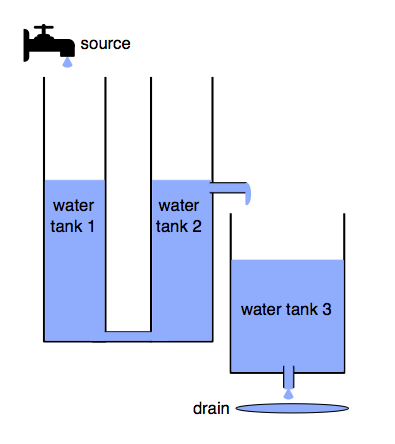

#  Three-tank Water Tank

## Overview

The three-tank water tank model is based upon a standard 20-sim example, and is developed to explore the impact on accuracy of multi-modelling across multiple CT models. The example comprises three water tanks which are filled and emptied. The first tank is filled from a source with a valve which may be turned on and off. The outflow of the first tank constitutes the inflow of the second, and so forth. A controller monitors the level of the third tank and controls a valve to a drain.

A key feature of this example is the close coupling required between water tank 1 and 2, and the loose coupling to water tank 3. Water tanks 1 and 2 are tall and thin and are connected by a pipe at the bottom of the tanks, and therefore changes to the level of water tank 1 (due to water entering from the source) will quickly affect the level in water tank 2. This effect is not as prevalent between water tank 2 and 3.

## Supported Features
This study supports the following INTO-CPS technologies:

* Multi-CT model
* 20-Sim (for FMU)
* VDM-RT (for FMU)
* INTO-CPS SysML  
* Co-simulation Engine (COE)
* Design Space Exploration
* Test Automation
* Code Generation

## Additional Information
Additional Information about this case study can be found in the [Examples Compendium](http://projects.au.dk/fileadmin/D3.5_Examples_Compendium_2.pdf#page=14)

Alternatively, contact the case study owner, [Carl Gamble](mailto:carl.gamble@ncl.ac.uk).
